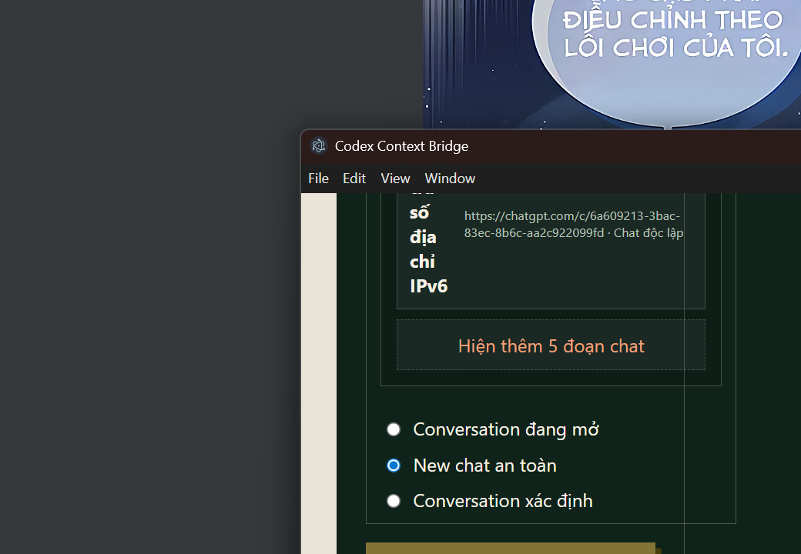
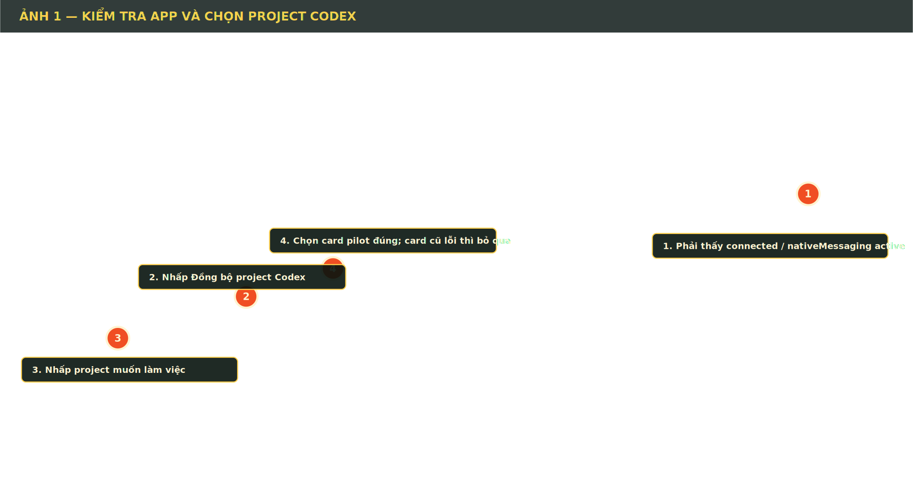
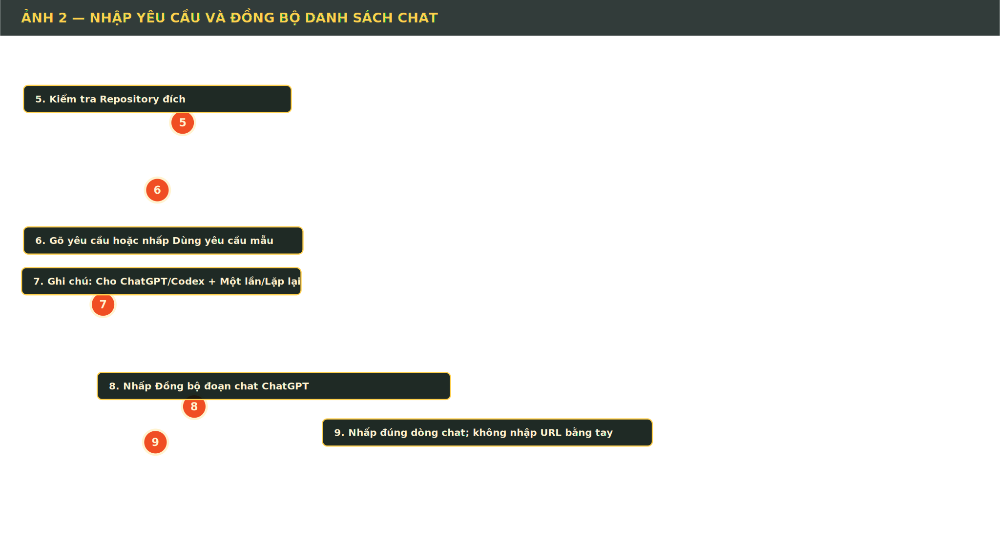
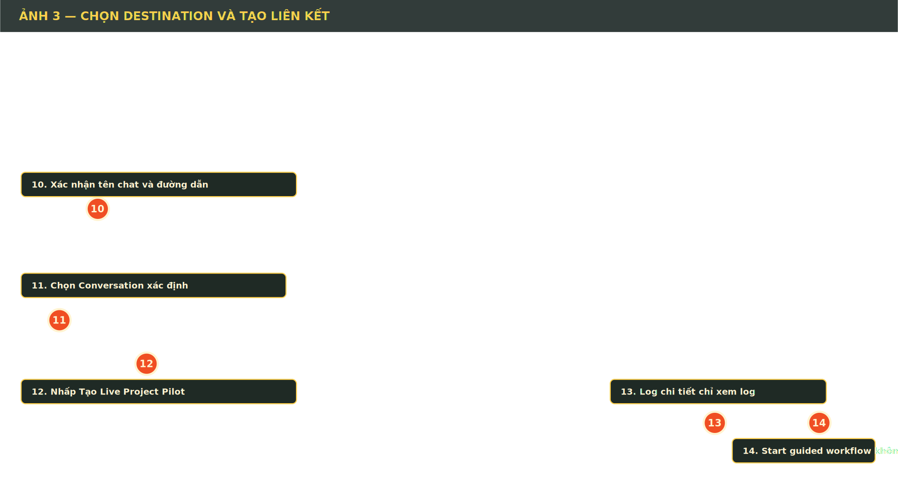
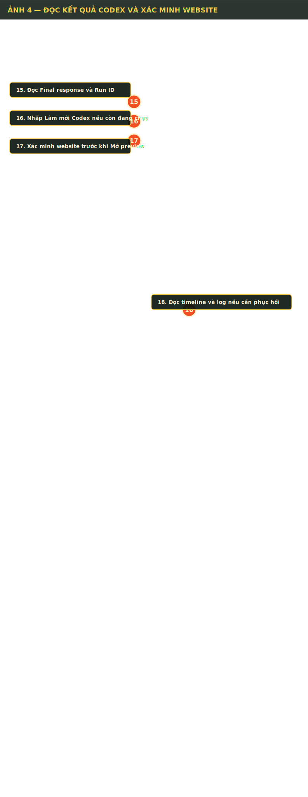

# Hướng dẫn bằng hình: nối một chat với một project

Tài liệu này dùng đúng các nhãn nút đang có trong `Codex Context Bridge`. Mỗi vòng tròn màu cam là một vị trí cần nhấp; số tăng dần theo thứ tự thao tác. Ảnh là ảnh chụp UI acceptance/live renderer để minh họa bố cục, nên tên project và tên chat có thể khác máy của bạn.

## Trước khi bắt đầu

1. Mở Edge, đăng nhập đúng tài khoản ChatGPT và mở đúng conversation.
2. Mở Codex Desktop và mở project cần làm việc ít nhất một lần.
3. Mở app từ shortcut `Codex Context Bridge`.
4. Chỉ tiếp tục khi ô trạng thái hiện `connected / nativeMessaging active`.

Ảnh chụp live bên dưới cho thấy dạng danh sách chat mà app sẽ nhận diện. Nội dung và số lượng dòng phụ thuộc tài khoản/workspace đang mở trong Edge.





## A. Chọn project Codex

### Nhấp 1 — kiểm tra kết nối

Nhìn ô `NATIVE TRANSPORT`. Nếu không có `connected / nativeMessaging active`, hãy reload extension Edge và tab ChatGPT trước; chưa tạo pilot khi trạng thái còn disconnected.

### Nhấp 2 — đồng bộ danh sách project

Nhấn `Đồng bộ project Codex`. App đọc catalog local đã được Codex lưu, không yêu cầu bạn nhập tên project bằng tay.

### Nhấp 3 — chọn project

Nhấp dòng project cần làm. Dấu `+` mở danh sách thread Codex; nhấp thêm một lần để mở rộng. Nếu danh sách dài, app hiển thị 5 thread đầu tiên và có nút `Hiện thêm 5 đoạn chat`.

### Chọn task cũ hay task mới

- Nhấp đúng thread Codex nếu muốn tiếp tục task cũ.
- Chỉ nhấp tên project nếu muốn Codex tạo task mới.

## B. Nhập yêu cầu và đồng bộ chat



### Nhấp 5 — kiểm tra repository

Ở `Repository đích`, xác nhận đường dẫn là đúng project. Không đổi thư mục khi Codex đang chạy.

### Nhấp 6 — nhập yêu cầu

Gõ yêu cầu vào ô `Yêu cầu`. Ví dụ:

```text
Phân tích project, sửa lỗi mobile, chạy kiểm thử và báo cáo các file đã thay đổi.
```

Bạn cũng có thể nhấn `Dùng yêu cầu mẫu` để kiểm tra thử giao diện.

### Nhấp 7 — thêm ghi chú có kiểm soát

Chọn:

- `Cho ChatGPT` nếu ghi chú giúp ChatGPT tạo prompt.
- `Cho Codex` nếu ghi chú dành cho phần triển khai.
- `Một lần` nếu chỉ áp dụng ở lượt kế tiếp.
- `Lặp lại` nếu muốn giữ trong các lượt sau.

Ghi chú chưa được gửi ngay; nó chỉ xuất hiện trong preview sau khi bạn tạo pilot.

### Nhấp 8 — đọc danh sách chat ChatGPT

Nhấn `Đồng bộ đoạn chat ChatGPT`. App chỉ đọc các link và tiêu đề đang hiển thị trong sidebar của những tab `chatgpt.com` mà bạn đã mở.

### Nhấp 9 — chọn đúng chat

Nhấp nguyên dòng có tên chat. Không nhập URL hoặc ID bằng tay nếu dòng chat đã xuất hiện. Nếu chưa thấy chat, mở sidebar ChatGPT, mở đúng conversation trong Edge rồi nhấn đồng bộ lại.

## C. Tạo liên kết



### Nhấp 10 — kiểm tra tên và URL

Đọc lại tên chat và URL. Với chat trong project ChatGPT, đường dẫn có thể chứa `/g/.../c/...`; không tự rút gọn thành `/c/...`.

### Nhấp 11 — chọn destination

- `Conversation đang mở`: dùng tab ChatGPT hiện tại.
- `New chat an toàn`: tạo chat mới.
- `Conversation xác định`: dùng chat bạn vừa nhấp trong danh sách.

Khi mục tiêu là nối một chat cụ thể, chọn `Conversation xác định`.

### Nhấp 12 — tạo pilot

Nhấn `Tạo Live Project Pilot`. Một card mới xuất hiện trong `Reviewed handoffs`. Card này lưu liên kết giữa chat ChatGPT, project/repository Codex, thread Codex, yêu cầu và ghi chú.

### Nhấp 13 — xem log

`Log chi tiết` chỉ mở lịch sử audit đã lọc an toàn. Dùng nó khi cần xem thời điểm lỗi, mã lỗi và kết quả thao tác.

### Nhấp 14 — hiểu đúng Assisted Mode

`Start guided workflow` chỉ tạo workflow/timeline cục bộ. Nút này không gửi tin nhắn ChatGPT và không chạy Codex thay cho Live Project Pilot.

## D. Cho pilot chạy

Trong card pilot mới, thực hiện theo thứ tự:

1. Nhấn `Kiểm tra ChatGPT`.
2. Chờ `Composer: Trống` và `Streaming: Không`.
3. Nhấn `Chuẩn bị ChatGPT handoff`.
4. Đọc preview, payload hash và conversation URL.
5. Nếu đúng, nhấn `Duyệt và gửi ChatGPT`.
6. Chờ ChatGPT trả về structured response hợp lệ.
7. Đọc phần `CODEX` và prompt được tạo.
8. Nhấn `Duyệt và gửi Codex`.
9. Chờ trạng thái chuyển sang hoàn tất; dùng `Làm mới Codex` nếu cần.

Ảnh dưới đây minh họa khu vực đọc kết quả Codex và timeline.



### Nhấp 15 — đọc kết quả

Đọc `Final response`, `Run ID`, `Thread ID` và số file thay đổi. Đây là báo cáo của Codex, không phải chỉ là thông báo giao diện.

### Nhấp 16 — làm mới Codex

Nếu Codex còn đang chạy hoặc renderer vừa khởi động lại, nhấn `Làm mới Codex`. Không nhấn gửi lại chỉ vì màn hình chưa cập nhật.

### Nhấp 17 — xác minh website

Nếu Codex tạo website, nhấn `Xác minh website`. Chỉ khi kết quả PASS mới nhấn `Mở preview`.

### Nhấp 18 — đọc timeline và log

Trong `GUIDED HANDOFF / ASSISTED MODE`, chọn workflow để xem timeline. Khi có lỗi, mở `Log chi tiết`, đọc mã lỗi và không lặp lại thao tác đang ở trạng thái `dispatching` nếu chưa xác nhận kết quả downstream.

## Điều app tự động và điều vẫn cần bạn duyệt

App tự động:

- Đồng bộ danh sách project/thread Codex.
- Đồng bộ tên, URL và ID chat ChatGPT từ DOM đã render.
- Lưu lịch sử ChatGPT định kỳ 30 giây.
- Theo dõi trạng thái ChatGPT/Codex.
- Tạo báo cáo và ZIP file thay đổi an toàn.

App vẫn dừng để bạn duyệt:

- `Duyệt và gửi ChatGPT`.
- `Duyệt và gửi Codex`.
- Đính kèm ZIP vào ChatGPT.

Vì vậy chế độ hiện tại là **assisted automation**: tự động hóa có kiểm duyệt, chưa phải vòng lặp gửi hoàn toàn không cần người.

## Nếu không hoạt động

| Hiện tượng               | Cách xử lý                                                                                           |
| ------------------------ | ---------------------------------------------------------------------------------------------------- |
| `TRANSPORT_DISCONNECTED` | Reload extension Edge, reload tab ChatGPT, giữ app mở rồi nhấn đồng bộ lại.                          |
| Không có project Codex   | Mở project trong Codex Desktop một lần, sau đó `Đồng bộ project Codex`.                              |
| Không có chat ChatGPT    | Mở sidebar và đúng conversation trong Edge, sau đó `Đồng bộ đoạn chat ChatGPT`.                      |
| URL tự về `chatgpt.com`  | Không dùng card cũ; mở đúng chat trong tài khoản hiện tại và tạo pilot mới từ dòng chat vừa đồng bộ. |
| Nút tạo pilot bị mờ      | Chưa có repository, yêu cầu, hoặc destination hợp lệ.                                                |
| Trạng thái `dispatching` | Không gửi lại ngay; kiểm tra downstream và log trước.                                                |

## Checklist nhanh

- [ ] Edge đang mở đúng tài khoản và đúng conversation.
- [ ] Codex Desktop đã mở đúng project.
- [ ] Native transport là `connected / nativeMessaging active`.
- [ ] Đã đồng bộ project Codex.
- [ ] Đã chọn thread Codex hoặc để tạo thread mới.
- [ ] Đã đồng bộ và nhấp đúng chat ChatGPT.
- [ ] Đã kiểm tra repository và yêu cầu.
- [ ] Đã chọn `Conversation xác định` nếu muốn nối chat cụ thể.
- [ ] Đã nhấn `Tạo Live Project Pilot`.
- [ ] Đã đọc preview trước mỗi nút `Duyệt và gửi`.
